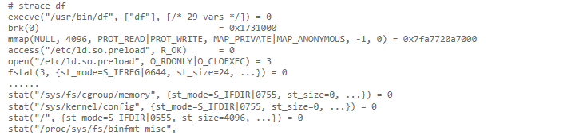

title: 2018-6-18未命名文件 
date: 2018-06-18 09:54:39
tags: [Docker]
categories: Docker
---


<!-- more -->

---

近期遇到了执行 `df`  后卡住的问题。

<!-- more -->

---

```
# strace df
execve("/usr/bin/df", ["df"], [/* 29 vars */]) = 0
brk(0)                                  = 0x1731000
mmap(NULL, 4096, PROT_READ|PROT_WRITE, MAP_PRIVATE|MAP_ANONYMOUS, -1, 0) = 0x7fa7720a7000
access("/etc/ld.so.preload", R_OK)      = 0
open("/etc/ld.so.preload", O_RDONLY|O_CLOEXEC) = 3
fstat(3, {st_mode=S_IFREG|0644, st_size=24, ...}) = 0
......
stat("/sys/fs/cgroup/memory", {st_mode=S_IFDIR|0755, st_size=0, ...}) = 0
stat("/sys/kernel/config", {st_mode=S_IFDIR|0755, st_size=0, ...}) = 0
stat("/", {st_mode=S_IFDIR|0555, st_size=4096, ...}) = 0
stat("/proc/sys/fs/binfmt_misc", 

```