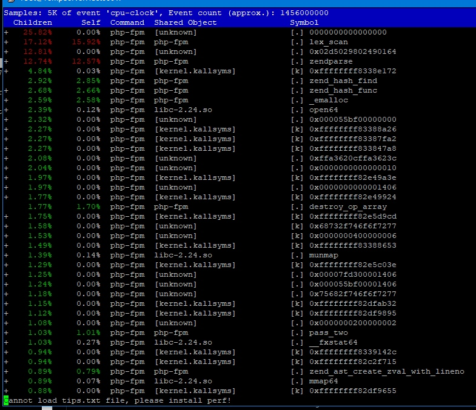
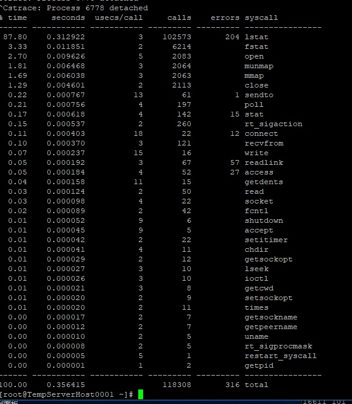
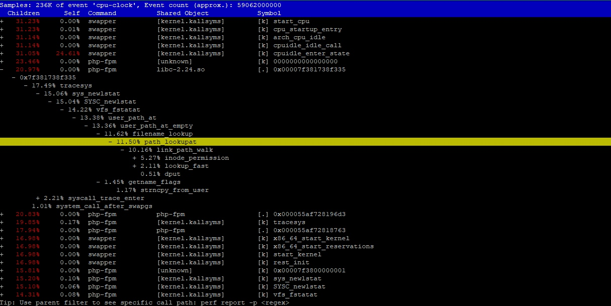

不知从何时开始，服务器会有偶发性的 cpu 占用报警，无法确定原因，只能临时通过`kill -USR2 1` 命令重启 php 来解决。

<!-- more -->

## 问题复现

将不同的 PHP 项目持续部署到线上后，不同的生产服务器会出现随机 cpu 飙升的问题。 

## 判定原因
首先猜测原因，确定排查方向：
- 代码故障导致内存溢出、死循环。
- 第三方服务故障导致请求超时。
- 其他。

## 逐一排查
### 代码故障排查
- 开启 PHP 的慢日志。
- 使用 apm 工具。

排查无果，因为 cpu 飙升后导致各个函数都执行缓慢。

后来发现部署其他 PHP 项目也会触发报警，且是部署完就出现，所以先排查项目内代码问题。
### 第三方服务故障排查
排除理由同上。
### 其他问题
排查进行到这一步，难度有些许提升，因为这可能不是代码层面的问题。需要进行更深层次的探索。

借助`perf`、`strace`、`top` 工具搭配抓出元凶。占用 CPU 较多的是函数是：`stat`、`lstat`、`lex_scan`，这些函数和文件读写有关。可能出现读写原因：
- open_basedir
- opache 未启用

## 确认
1. 首先关闭 open_basedir，strace 中`stat`减少，情况略有缓解，但是多次部署后还会出现这个问题。
2. opache 目前是开启的。
3. 但尽管 opache 开启了，但可能是 opache 缓存满了。

调用 PHP 函数来验证猜想：`opcache_get_status(false)` 、`opcache_reset()`，发现 CPU 飙升时，opache 也满了，此时清空缓存，CPU 也立即恢复正常。
## 解决
部署代码成功后，自动清除 opcache 缓存。清理方法参考下一篇笔记。